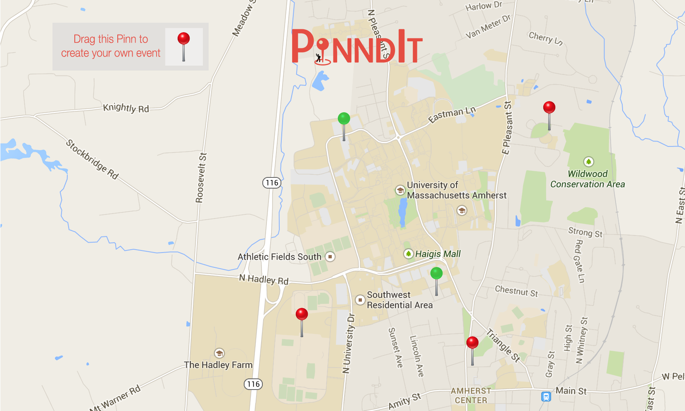
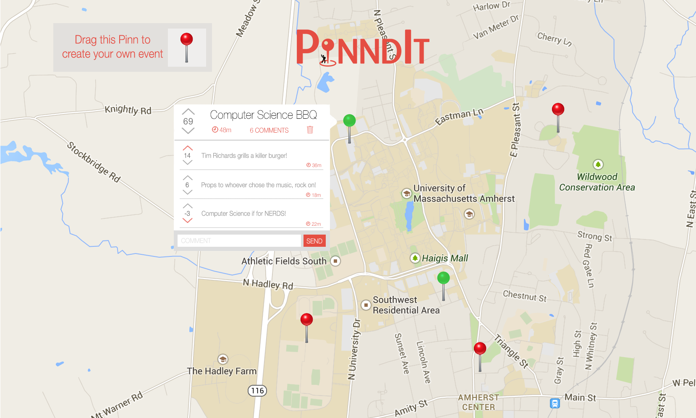
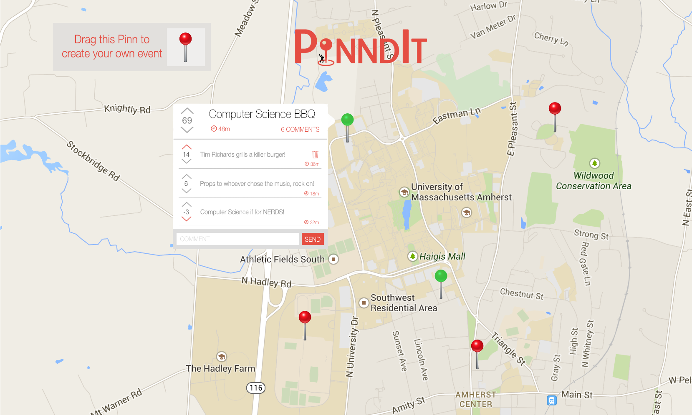

Functional/User Specification

## Team Organization

**Dylan Terry** - Software Engineer

Responsible for the organization and development of the codebase for the PinndIt webpage.

**Steve Jones** - Project Manager

Responsible for guiding the plan and development of PinndIt to meet our goals and requirements.

**Ryan Herlihy** - Lead Content Editor

	Responsible for the quality, presentation and effectiveness of PinndIt documents, 

visuals and code implementations. Focuses on reviewing all team members contributions and making necessary adjustments if needed.

**Ariel Reches** - Duke of Customer Satisfaction/Software Engineer

	Evangelize about PinndIt to the people and convey their concerns to the company.

Also organize and develop the software. 

**Stephen Collins** - Web Strategist

Responsible for fixing and solving implementation problems when they arise. Also responsible for spreading the word of PinndIt as well as recording our teams progress.

**Derek Costigan** - Director of Quality Assurance

Responsible for thoroughly testing the application and making sure there are no serious bugs or issues. Then report these issues as they arise and help develop a solution.  

Written by all - 10/05/2014* * *

## Overview

PinndIt is the social event broadcasting app where users can drop a Pinn at the location of an event. Users are able to view this on a map interface where each Pinn represents an event. Users at the location are able to "upvote" or “downvote” each Pinn depending on the experience of the event. As the event accumulates votes the Pinn may change color from the default red to green if the event is highly regarded. This gives prospective event attendees an idea of if they are interested in going to the event. For example if Sigma Phi Epsilon has a barbecue to raise money for cancer research, someone can drop a Pinn at the event and people can vote on if the event is enjoyable. 

As a user selects an event a window will pop up with the capability to read and write comments. Each individual comment will have the same rating system applied to the Pinns and will enable users to post valuable information about the event. For example a comment saying, "Free food!" might convince someone to come to an event over a simple green Pinn icon. 

Written by Steve Jones & Derek Costigan - 10/05/2014* * *

## User case scenarios

Scenario 1: Susan is hosting a booth at the weekly amherst farmers’ market and has extra rhubarb this week, she wants to bring more people to the market so she can sell off her surplus. Susan opens PinndIt and drops a Pinn on the Amherst Town Common with the title "Amherst Farmers’ Market" and the description, “So much rhubarb, you don’t even know” so more people will visit the market and maybe buy some rhubarb.

Scenario 2: It’s Karaoke night at Worcester dining hall and turnout is surprisingly low. Jamie, who’s in charge of the event decides to see how her Pinn is doing. She sees that the Pinn has 5 upvotes and 9 downvotes! The top comment under the Pinn reads,"if another lady gaga song comes on I’m outta here", and it has 7 upvotes. The second top comment reads, “seriously, no Biebs at Karaoke night” and it has 5 upvotes. No wonder nobody’s coming! Jamie pulls the mic on the kid singing “Just Dance” and announces no more Lady Gaga. The crowd erupts and Jamie sees many of them pulling out their smartphones. Many of them go on PinndIt to change their downvotes to upvotes. Karaoke night rescued. 

Scenario 3: Tim is craving a hamburger and hotdog, but is feeling cheap and doesn’t want to spend any money for lunch. He heard from his friends last night that there will be a barbecue outside of the student union. He doesn’t remember what time the event is being held. Tim opens PinndIt and clicks on the red Pinn over the student union, sees in the event description that the event started at 1:00, and plans accordingly. 

Scenario 4: It’s another Friday night and Sam is pumped. He always looks forward to the weekend. But it’s getting late and he still hasn’t heard about anything from his friends. Luckily at UMASS Amherst, everyone’s on PinndIt. Sam opens PinndIt and the map is bursting with Pinns. Sam sees one party on Phillips St. has 300 upvotes, half Sam’s crew is out the door already to head there but... hold up! There’s a green Pinn over Antonio’s reading "free pizza for all PinndIt users!". Looks like Sam and his friends are going to get cheesy tonight.

Scenario 5: Jordan drops a Pinn on his house for a slip and slide competition. He realizes 3 minutes later he neither knows how to slip nor slide. Also he doesn’t have running water and it’s below freezing out. He promptly deletes the Pinn before too many people show up.

Scenario 6:  Drew is relaxing at his house on a Friday night watching Game of Thrones with a few of his bros. He opens up PinndIt to check what events there are on in his area. He sees immediately that there’s a Pinn on his house that says, "Party at 560 Puffton Village!" Drew gets outraged and tells his friends. They all mark the Pinn as spam and the Pinn soon gets deleted. Now Drew can sit back and enjoy his show.

Scenario 7: Alex used PinndIt yesterday to find some sweet free events in his area. He wakes up today and he is looking forward to another day of enjoying great local events. He opens up PinndIt again, his location is acquired, and a map of his area appears. All the Pinns with yesterdays events have disappeared, and a new set of Pinns are now visible with todays events.

Scenario 8: 

Zachariah is having his 67th birthday party and attempts to put a Pinn down on his farm  but a message pops up saying "You have too many live Pinns, would you like to delete one?" He suddenly remembers that he already put down a bunch of Pinns for his birthday party! He decides to delete one of them so he can put up another one. 

Written by all - 10/05/2014* * *

## Non-Goals

* Accounts and User Login

* Custom Pinns

* Third-party integration

* List of events

Written by all- 10/05/2014* * *

**Wireframe Images**

Opening Screen, able to drag and drop your own pinn, or click a pinn for details. Pinn colors represent popularity.

When creating pinn, box appears to name your pinn

Click on pinn: see pin details, comments, up/down votes, time

Click your own pinn: Trash icon to delete

When clicking a pinn you commented on: Comment has trash icon to delete

Written by Steve Jones - 10/05/2014

* * *

## Flowchart

Written by Dylan Terry - 10/05/2014

* * *

## Open Issues

* Algorithm for Pinn popularity.

* Algorithm for deleting old or unpopular Pinns

* Deciding on Pinn color

* Deciding if there’s a limit to the distance between a user and a pinn they’d like to drop

* How we’ll limit Pinns per day per user

* How we’ll handle Pinns dropped on the same location.

* Handling Pinns when zooming out

